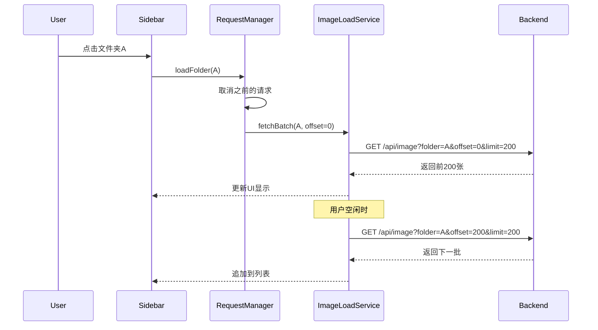
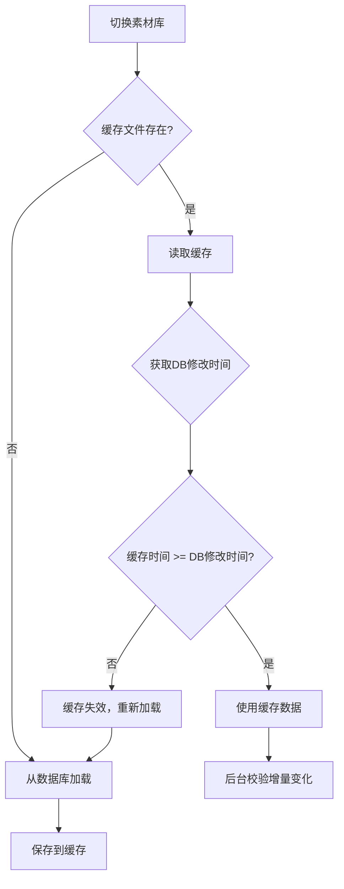

# Design Document

## Overview

本设计文档描述素材库切换性能优化的技术方案。核心思路是将"一次性加载全部数据"改为"按需分批加载"，并引入健壮的请求管理机制来处理取消、竞态和空闲加载。

## Architecture

### 整体架构

```
┌─────────────────────────────────────────────────────────────┐
│                      Frontend                                │
│  ┌─────────────┐  ┌──────────────┐  ┌───────────────────┐  │
│  │   Sidebar   │  │ MainContent  │  │  ImageWaterfall   │  │
│  │  (文件夹树)  │  │  (协调加载)   │  │   (虚拟滚动)      │  │
│  └──────┬──────┘  └──────┬───────┘  └─────────┬─────────┘  │
│         │                │                     │             │
│         └────────────────┼─────────────────────┘             │
│                          ▼                                   │
│              ┌───────────────────────┐                      │
│              │   RequestManager      │                      │
│              │  (请求管理/取消/队列)  │                      │
│              └───────────┬───────────┘                      │
│                          │                                   │
│              ┌───────────────────────┐                      │
│              │   ImageLoadService    │                      │
│              │  (分批加载/空闲加载)   │                      │
│              └───────────┬───────────┘                      │
└──────────────────────────┼──────────────────────────────────┘
                           │
                           ▼
┌─────────────────────────────────────────────────────────────┐
│                      Backend                                 │
│  ┌─────────────────────────────────────────────────────┐   │
│  │              Image API (分页支持)                     │   │
│  │  GET /api/image?libraryId=x&folder=y&offset=0&limit=200│   │
│  └─────────────────────────────────────────────────────┘   │
└─────────────────────────────────────────────────────────────┘
```

### 数据流



## Components and Interfaces

### 1. RequestManager (新增)

负责管理所有异步请求的生命周期。

```typescript
interface RequestManager {
  // 创建一个新的请求上下文
  createRequest(type: 'library' | 'folder' | 'images'): RequestContext;
  
  // 取消指定类型的所有请求
  cancelAll(type: 'library' | 'folder' | 'images'): void;
  
  // 取消所有请求
  cancelAllRequests(): void;
  
  // 检查请求是否仍然有效
  isValid(requestId: string): boolean;
}

interface RequestContext {
  id: string;
  abortController: AbortController;
  signal: AbortSignal;
  isActive: boolean;
  cancel(): void;
}
```

### 2. ImageLoadService (新增)

负责图片的分批加载和空闲加载逻辑。

```typescript
interface ImageLoadService {
  // 加载文件夹的第一批图片
  loadInitialBatch(libraryId: string, folder: string | null): Promise<ImageBatch>;
  
  // 加载下一批图片
  loadNextBatch(): Promise<ImageBatch>;
  
  // 开始空闲加载
  startIdleLoading(): void;
  
  // 暂停空闲加载
  pauseIdleLoading(): void;
  
  // 获取加载状态
  getLoadingState(): LoadingState;
}

interface ImageBatch {
  images: Image[];
  offset: number;
  total: number;
  hasMore: boolean;
}

interface LoadingState {
  isLoading: boolean;
  loadedCount: number;
  totalCount: number;
  currentFolder: string | null;
}
```

### 3. 后端 API 扩展

```typescript
// 扩展现有的 GET /api/image 接口
interface ImageSearchParams {
  libraryId: string;
  folder?: string;
  keywords?: string;
  offset?: number;  // 新增：分页偏移
  limit?: number;   // 新增：每页数量
  // ... 其他现有参数
}

interface ImageSearchResponse {
  images: Image[];
  total: number;    // 新增：总数
  offset: number;   // 新增：当前偏移
  hasMore: boolean; // 新增：是否有更多
}
```

### 4. Store 扩展

```typescript
// useStore 新增状态
interface ImageLoadingState {
  // 当前加载状态
  isLoadingImages: boolean;
  loadedImageCount: number;
  totalImageCount: number;
  hasMoreImages: boolean;
  
  // 当前加载上下文
  currentLoadContext: {
    libraryId: string | null;
    folder: string | null;
    requestId: string | null;
  };
}
```

### 5. CacheService (新增)

负责图片元数据的本地文件缓存。

```typescript
interface CacheService {
  // 获取素材库缓存
  getLibraryCache(libraryId: string): Promise<LibraryCache | null>;
  
  // 保存素材库缓存
  saveLibraryCache(libraryId: string, data: LibraryCache): Promise<void>;
  
  // 验证缓存是否有效
  validateCache(libraryId: string): Promise<CacheValidation>;
  
  // 获取文件夹缓存
  getFolderCache(libraryId: string, folder: string): Promise<FolderCache | null>;
  
  // 保存文件夹缓存
  saveFolderCache(libraryId: string, folder: string, images: Image[]): Promise<void>;
  
  // 清除缓存
  invalidateCache(libraryId: string): Promise<void>;
}

interface LibraryCache {
  version: number;           // 缓存版本号
  libraryId: string;
  createdAt: number;         // 缓存创建时间
  dbModifiedAt: number;      // 数据库最后修改时间
  totalCount: number;        // 总图片数
  folders: FolderSummary[];  // 文件夹摘要（不含图片详情）
}

interface FolderCache {
  folder: string;
  images: Image[];
  cachedAt: number;
  imageCount: number;
}

interface CacheValidation {
  isValid: boolean;
  reason?: 'not_found' | 'stale' | 'corrupted';
  dbModifiedAt?: number;
  cacheModifiedAt?: number;
}
```

### 6. 后端缓存 API (新增)

```typescript
// 获取缓存元数据
// GET /api/cache/meta/:libraryId
interface CacheMetaResponse {
  dbModifiedAt: number;      // 数据库最后修改时间戳
  totalImages: number;
  totalFolders: number;
}

// 获取完整缓存数据（用于初始化）
// GET /api/cache/full/:libraryId
interface FullCacheResponse {
  meta: CacheMetaResponse;
  folders: FolderTree[];
  // 注意：不返回所有图片，只返回文件夹结构
}

// 获取文件夹图片（带缓存头）
// GET /api/image?libraryId=x&folder=y&offset=0&limit=200
// Response Header: X-Folder-Modified: timestamp
```

## Data Models

### 请求上下文

```typescript
interface RequestContext {
  id: string;              // 唯一请求ID (UUID)
  type: 'library' | 'folder' | 'images';
  createdAt: number;       // 创建时间戳
  abortController: AbortController;
  status: 'pending' | 'completed' | 'cancelled' | 'error';
}
```

### 加载队列项

```typescript
interface LoadQueueItem {
  libraryId: string;
  folder: string | null;
  offset: number;
  limit: number;
  priority: 'high' | 'normal' | 'idle';
  requestContext: RequestContext;
}
```

### 缓存文件结构

缓存文件存储在 `.flypic/cache/` 目录下：

```
.flypic/
├── metadata.db          # SQLite 数据库
├── thumbnails/          # 缩略图
└── cache/               # 新增：缓存目录
    ├── library.json     # 素材库级别缓存（文件夹树+元数据）
    └── folders/         # 文件夹级别缓存
        ├── {hash1}.json # 文件夹图片列表缓存
        └── {hash2}.json
```

### 缓存文件格式

```typescript
// library.json
interface LibraryCacheFile {
  version: 1;
  libraryId: string;
  createdAt: number;
  dbModifiedAt: number;
  totalCount: number;
  folderTree: FolderNode[];
}

// folders/{hash}.json
interface FolderCacheFile {
  version: 1;
  folder: string;
  cachedAt: number;
  folderModifiedAt: number;  // 该文件夹最后修改时间
  images: ImageMetadata[];   // 精简的图片元数据
}

// 精简的图片元数据（减少缓存大小）
interface ImageMetadata {
  id: number;
  path: string;
  filename: string;
  width: number;
  height: number;
  thumbnail_path: string;
  file_type: string;
  created_at: number;
}
```

## 缓存策略

### 缓存失效判断



### 增量更新

当检测到数据库有变化时，不需要完全重建缓存：

1. 比较 `indexed_at` 时间戳找出新增/修改的图片
2. 比较文件夹列表找出新增/删除的文件夹
3. 只更新变化的部分


## Correctness Properties

*A property is a characteristic or behavior that should hold true across all valid executions of a system-essentially, a formal statement about what the system should do. Properties serve as the bridge between human-readable specifications and machine-verifiable correctness guarantees.*

### Property 1: Request cancellation on library switch
*For any* library switch operation, all pending requests from the previous library should be cancelled (aborted) before new requests are initiated.
**Validates: Requirements 1.2**

### Property 2: Memory cleanup on library switch
*For any* library switch operation, the previous library's image data should be cleared from the store state, and the new state should only contain data from the new library.
**Validates: Requirements 1.3**

### Property 3: Request cancellation on folder switch
*For any* folder selection while a previous folder's images are still loading, the previous folder's loading request should be cancelled.
**Validates: Requirements 2.2**

### Property 4: Scroll triggers batch loading
*For any* folder with more images than the initial batch size, scrolling to the bottom should trigger loading of the next batch.
**Validates: Requirements 2.3**

### Property 5: Debounce rapid folder clicks
*For any* sequence of rapid folder clicks (within debounce window), only the final folder selection should result in a completed request.
**Validates: Requirements 3.2**

### Property 6: Background loading pauses on user action
*For any* user-initiated action (folder click, library switch) while background loading is in progress, the background loading should pause until the user action completes.
**Validates: Requirements 3.3**

### Property 7: Unique request IDs
*For any* set of requests created by RequestManager, each request should have a unique ID that is different from all other request IDs.
**Validates: Requirements 4.1**

### Property 8: Cancelled requests don't trigger callbacks
*For any* cancelled request, its completion callback should not be executed, and its result should not be applied to the state.
**Validates: Requirements 4.2**

### Property 9: Only latest request result applied
*For any* sequence of requests for the same resource (folder/library), only the result of the most recently initiated request should be applied to the state, regardless of completion order.
**Validates: Requirements 4.3**

### Property 10: Unmount cancels all requests
*For any* component unmount event, all pending requests associated with that component should be cancelled.
**Validates: Requirements 4.4**

### Property 11: Batch loading updates display incrementally
*For any* batch load completion, the displayed image count should increase by the batch size (or remaining count if less).
**Validates: Requirements 5.2**

### Property 12: Cache file creation after full load
*For any* library that completes full image loading, a cache file should exist in the .flypic/cache directory.
**Validates: Requirements 6.1**

### Property 13: Cache used when valid
*For any* library switch where valid cache exists (cache timestamp >= db modification timestamp), the images should be loaded from cache without database query.
**Validates: Requirements 6.2**

### Property 14: Cache validation compares timestamps
*For any* cache validation operation, the system should compare the cache's dbModifiedAt timestamp with the current database modification timestamp.
**Validates: Requirements 6.3**

### Property 15: Stale cache triggers reload
*For any* cache where dbModifiedAt < current database modification timestamp, the cache should be invalidated and data should be reloaded from database.
**Validates: Requirements 6.4**

### Property 16: Folder cache creation
*For any* folder whose images are fully loaded, a separate cache file should be created for that folder.
**Validates: Requirements 7.1**

### Property 17: Folder cache invalidation on content change
*For any* folder whose content changes (images added/removed), the folder's cache should be invalidated on next access.
**Validates: Requirements 7.3**

### Property 18: LRU cache eviction
*For any* state where folder cache count exceeds the maximum threshold, the least recently used folder cache should be evicted first.
**Validates: Requirements 7.4**

## Error Handling

### 网络错误
- 请求超时：显示重试按钮，允许用户手动重试
- 网络断开：显示离线提示，使用缓存数据（如果可用）

### 缓存错误
- 缓存文件损坏：删除损坏的缓存，从数据库重新加载
- 缓存写入失败：记录警告日志，继续正常运行（缓存是优化，不是必需）

### 并发错误
- 竞态条件：通过 requestId 机制确保只应用最新请求的结果
- 重复请求：通过 debounce 和请求去重避免

## Testing Strategy

### 单元测试

使用 Vitest 进行单元测试：

1. **RequestManager 测试**
   - 测试请求创建和 ID 唯一性
   - 测试请求取消功能
   - 测试按类型取消请求

2. **CacheService 测试**
   - 测试缓存文件读写
   - 测试缓存验证逻辑
   - 测试缓存失效判断

3. **ImageLoadService 测试**
   - 测试分批加载逻辑
   - 测试空闲加载触发

### 属性测试

使用 fast-check 进行属性测试：

1. **请求管理属性测试**
   - Property 7: 生成随机数量的请求，验证所有 ID 唯一
   - Property 8: 生成请求序列，取消部分，验证回调行为
   - Property 9: 生成乱序完成的请求，验证只应用最新结果

2. **缓存属性测试**
   - Property 14/15: 生成随机时间戳组合，验证缓存验证逻辑
   - Property 18: 生成随机访问序列，验证 LRU 驱逐顺序

### 集成测试

1. **素材库切换流程测试**
   - 模拟切换素材库，验证请求取消和状态清理
   
2. **文件夹导航测试**
   - 模拟快速点击多个文件夹，验证 debounce 和取消逻辑

3. **缓存集成测试**
   - 测试完整的缓存创建、读取、失效流程
